# Predicting Heart disease 

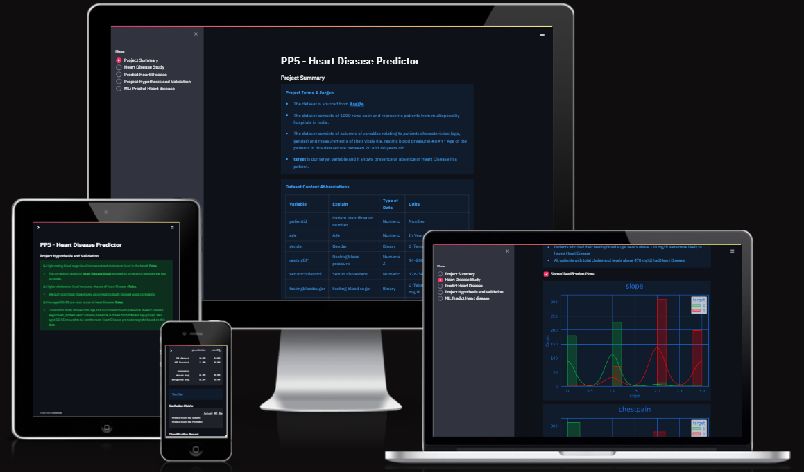

Link to the [live dashboard](https://pp5-heart-disease-predict-8ca5a8fcd037.herokuapp.com/) 

This is my 5th Portfolio Project submission as part of my specialization module 'Predictive Analytics' for Code Institute's Diploma in Full Stack Development course.

This project is an attempt to create a Machine Learning model t predict Heart Diseasee for a fictional client.

---

## Contents

* [Dataset Content](#dataset-content) 🗃️

* [Business Requirements](#business-requirements) 📋

* [Hypothesis and How To Validate](#hypothesis-and-how-to-validate) 💡

* [Rationale](#the-rationale-to-map-the-business-requirements-to-the-data-visualizations-and-ml-tasks) ✍

* [ML Business Case](#ml-business-case) 📊

* [Dashboard Design](#dashboard-design) 📐

* [Unfixed Bugs](#unfixed-bugs) 🛠️

* [Deployment](#deployment) 🖥️

* [Data Analysis and ML Libraries](#data-analysis-and-ml-libraries) 📚

* [Credits and Acknowledgments](#credits-and-acknowledgments) 💐

## Dataset Content

This heart disease dataset is acquired from one of the multispecialty hospitals in India and is sourced from [Kaggle](https://www.kaggle.com/codeinstitute/telecom-churn-dataset). This dataset consists of 1000 rows with 14 columns and represents patient characteristics (age, gender), their vital measurements (resting blood preasure, maximum heart rate) and heart desease classification. We are going to use the latter as a target variable throughout the project.

The dataset's variable names, meanings and units can be inspected below: 
 

| Variable | Explain | Type of Data | Units |
| :---- | :---- | :---- | :---- |
| patientid | Patient identification number | Numeric | Number |
| age | Age | Numeric | In Years |
| gender | Gender | Binary | 0 (female) / 1 (male) |
| restingBP | Resting blood pressure | Numeric Z| 94-200 (in mm HG) |
| serumcholestrol | Serum cholesterol | Numeric | 126-564 (in mg/dl) |
| fastingbloodsugar | Fasting blood sugar | Binary | 0 (false) / 1 (true) > 120 mg/dl |
| chestpain | Chest pain type | Nominal | 0 (typical angina), 1 (atypical angina), 2 (non-anginal pain), 3 (asymptomatic) |
| restingelectro | Resting electrocardiogram results | Nominal | 0 (normal), 1 (ST-T wave abnormality), 2 (probable or definite left ventricular hypertrophy) |
| maxheartrate | Maximum heart rate achieved | Numeric | 71-202 |
| exerciseangina | Exercise induced angina | Binary | 0 (no) / 1 (yes) |
| oldpeak | Oldpeak = ST | Numeric | 0-6.2 |
| slope | Slope of the peak exercise ST segment | Nominal | 1 (upsloping), 2 (flat), 3 (downsloping) |
| noofmajorvessels | Number of major vessels | Numeric | 	0, 1, 2, 3 |
| target | Heart disease status | Binary | 0: Absent, 1: Present |

## Business Requirements

Our fictitious client 'Silent Hearts' is a Healthcare provider based in India. They are requesting help to analize the data and provide data-driven solution in predicting Heart Disease to maximise the benefit of early discovery and increase the chance of recovery amongst patients.

1 - The client is interested in discovering how Heart Disease is affected by listed variables. Therefore, the client expects data visualisations of the correlated variables against the target to show that.

2 - The client is interested in predicting whether or not a patient has Heart Disease.

## Hypothesis and how to validate?

1. High resting blood sugar level increases total cholesterol level in the blood.
* Correlation Study

2. Higher cholesterol level increases chance of Heart Disease.
* Correlation Study

3. Men aged 50-55 are most prone to Heart Disease.
* Filter data for male patients with Heart Disease and plot it accordn to age separated into appropriate bins.

## The rationale to map the business requirements to the Data Visualizations and ML tasks

**Business Requirement 1:** Data Visualisation and Correlation Study
* We will inspect the data related to the patient base.
* We will conduct a correlation study (Pearson and Spearman) to understand better how the variables are correlated to Heart Disease.
* We will plot the main variables against Heart Disease Status to visualize insights.

**Business Requirement 2:** Classification and Data Analysis
* We want to predict if a patient has heart disease or not. We want to build a binary classifier.

## ML Business Case

1. What are the business requirements?
* The client is interested in discovering how clinical measurements and patient characteristics correlate with Heart Disease presence. Therefore, the client expects data visualizations of the correlated variables against the Heart Disease status.
* The client is interested in predicting whether on not a patiente has Heart Disease.

2. Is there any business requirement that can be answered with conventional data analysis?
Yes, we can use conventional data analysis to investigate how clinical measurements and patient characteristics correlate with Heart Disease presence.

3. Does the client need a dashboard or an API endpoint?
The client needs a dashboard.

4. What does the client consider as a successful project outcome?
* A study showing the most relevant variables correlated to Heart Disease Status.
* Also, a capability to predict heart disease in patients from given data.

5. Can you break down the project into Epics and User Stories?

* Information gathering and data collection.
* Data visualization, cleaning, and preparation.
* Model training, optimization and validation.
* Dashboard planning, designing, and development.
* Dashboard deployment and release.

6. Are there Ethical or Privacy concerns?
No. The client found a public dataset.

7. Does the data suggest a particular model?
The data suggests a classification where the target is the Heart Disease status.

8. What are the model's inputs and intended outputs?
The inputs are clinical measurements and patient characteristics and the output is binary classification of absence/presence of Heard Disease.

9. What are the criteria for the performance goal of the predictions?
We agreed with the client an accuracy score of 96% and recall of atleast 98% on the test sets 'HD present' value.

10. How will the client benefit?
By predicting Heart Disease to maximise the benefit of early discovery and increase the chance of recovery amongst patients.

## Dashboard Design

### Page 1 
### Project Summary
* Project Terms & Jargon
* Describe Project Dataset
* State Business Requirements

The Project Summary page outlines the project's terminology and jargon, provides a description of the dataset, and details the business requirements. Users can gain a comprehensive overview of the project here, along with access to the readme file and a link to the dataset on Kaggle.

The variable for the dataset are explained in detail:

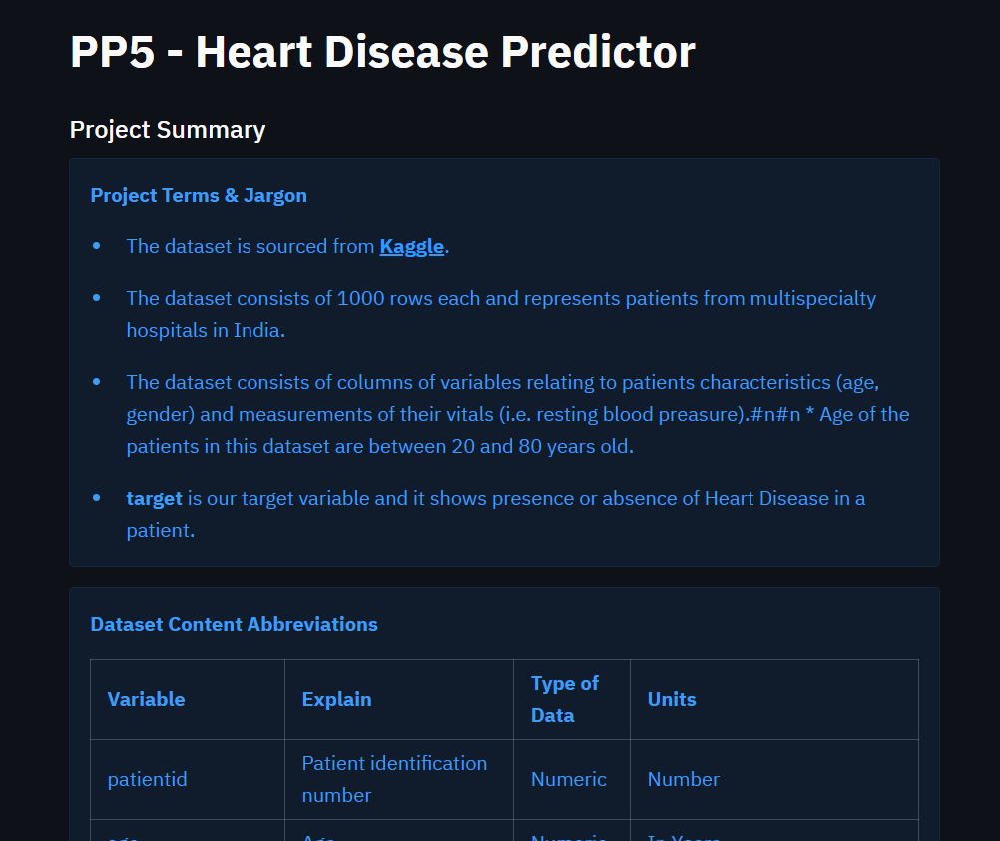

### Page 2
### Heart Disease Study
* This page fulfills Business Requirement 1. It shows target correlation with other variables.

    * data inspection on house attributes
    
    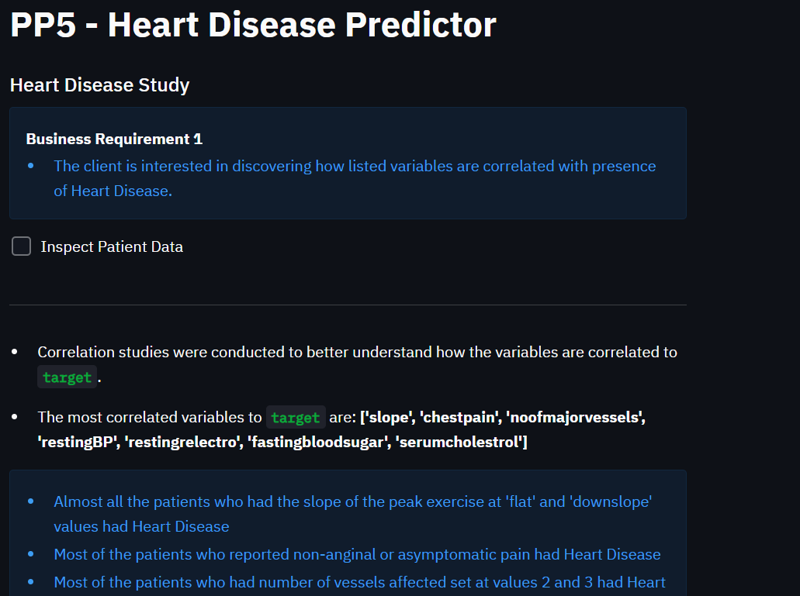

    * highlight the most correlated/relevant variables to Sale Price and the conclusions
    
    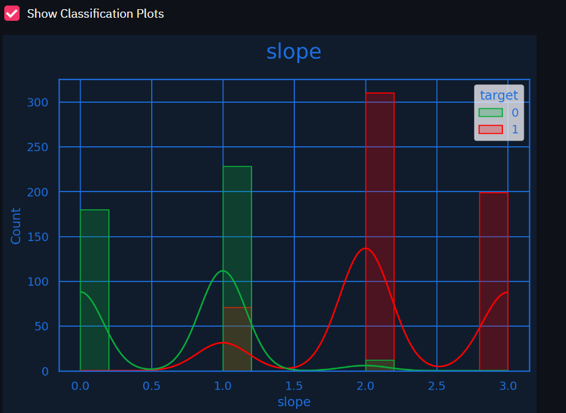

    * include plot to gain insight to Hypothesis #3
    
    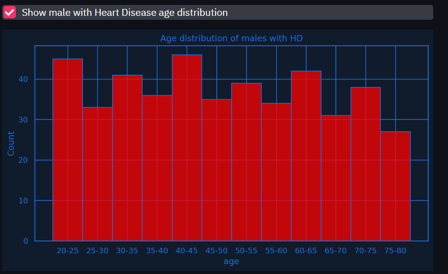

### Page 3
### Heart Disease Prediction
* This page contains a Heart Disease predictor based on live inputs
    
    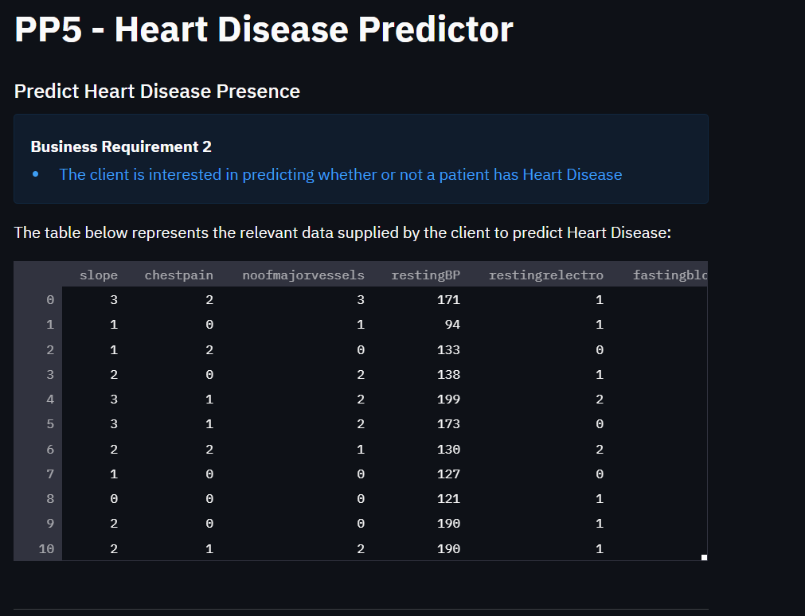

    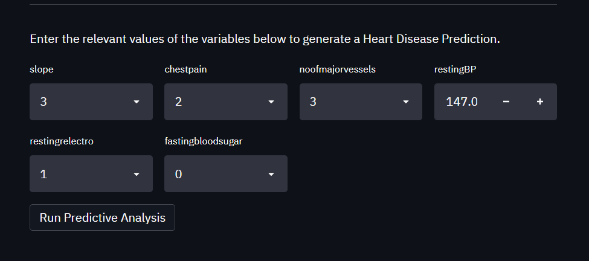

### Page 4
### Hypothesis and validation
* Initial hypothesis, conclusions and their validation methods are displayed on this page
    
    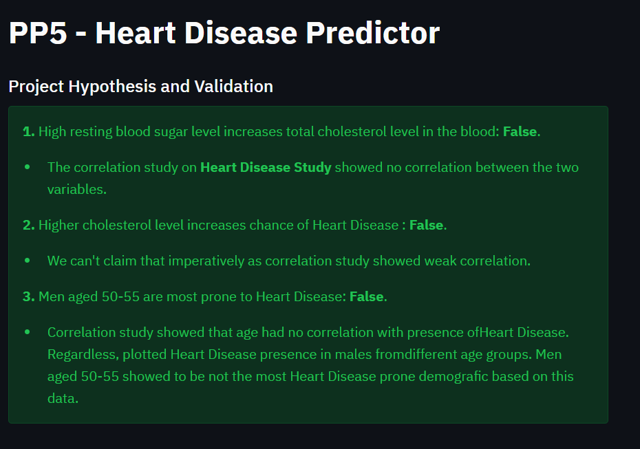

### Page 5
### Hypothesis and validation
* ML learning approach and pipelines used are displayed n this page
    
    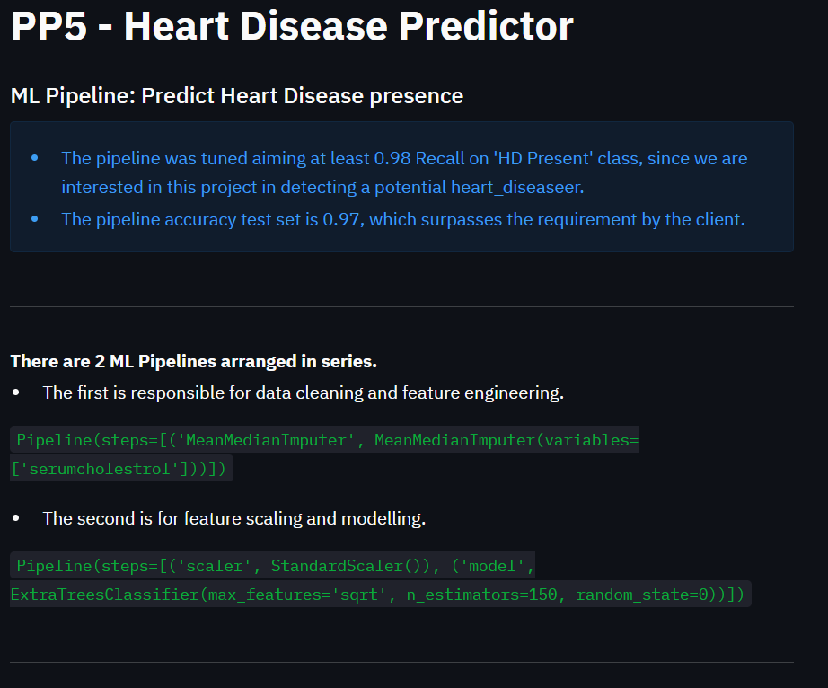

    * most correlated features
    
    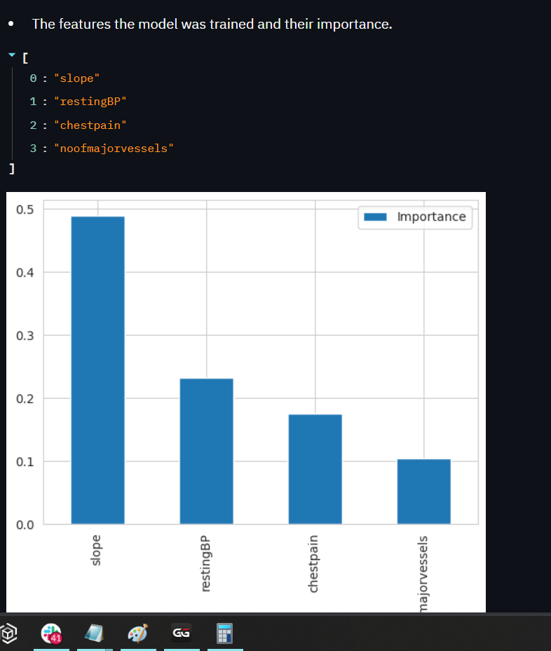

    * performance results
    
    

## Unfixed Bugs
Upon deployment, Heroku no longer supports the Python version 3.8 in it's Heroku-22 stack. 

The stack was manually changed in the terminal to Heroku-20 using the following command: `heroku stack:set heroku-20 -a your-project-name`

However this will become obsolete on 24th December 2024 so will need to be fixed.

### BUG 1
* Got this error whilst running stremlit

    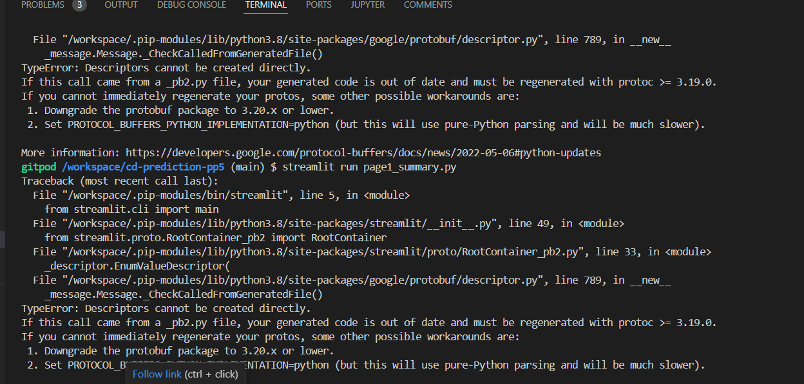

    Solved by installing protobug while running the command 'pip install protobuf==3.20'

### BUG 2
* First plot in a series of plots didn't get desired colouring as displayed in the screenshot

    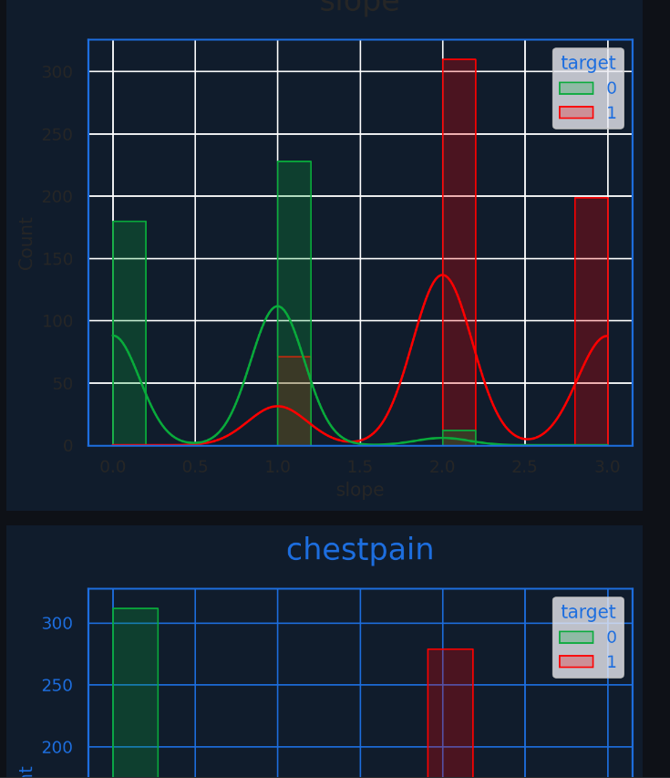

    Solved by relocating plot_coloring function above the function that creates the plot

## Deployment
### Heroku

* The App live link is: https://pp5-heart-disease-predict-8ca5a8fcd037.herokuapp.com/
* Set the runtime.txt Python version to a [Heroku-20](https://devcenter.heroku.com/articles/python-support#supported-runtimes) stack currently supported version.
* The project was deployed to Heroku using the following steps.

1. Log in to Heroku and create an App
2. At the Deploy tab, select GitHub as the deployment method.
3. Select your repository name and click Search. Once it is found, click Connect.
4. Select the branch you want to deploy, then click Deploy Branch.
5. The deployment process should happen smoothly if all deployment files are fully functional. Click now the button Open App on the top of the page to access your App.
6. If the slug size is too large then add large files not required for the app to the .slugignore file.

## Data Analysis and ML Libraries
* [Pandas](https://pandas.pydata.org/) for data analysis, exploration, manipulation and visualization e.g.e create dataframes throughout the Jupyter Notebooks
* [NumPy](https://numpy.org/) was used to process arrays and data 
* [Matplotlib](https://matplotlib.org/) for graphs and plots
* [Seaborn](https://seaborn.pydata.org/) to visualize the data in the Streamlit app with graphs and plots
* [ML: Scikit-learn](https://scikit-learn.org/stable/) used when creating the ML pipeline, applying algorithms and feature engineering

## Credits and Acknowledgments 

### Content 

- This project was adapted from Code Institute's ['Churnometer'](https://github.com/Code-Institute-Solutions/churnometer) walkthrough project.
- Bulk of workflow and dashboard design was inspired by [Megan Odonohoe's work](https://github.com/modonohoe/data-analytics-housing-project).

### Media

* Media are screenshots from my notebooks and dashboard.

### Acknowledgements
* Alumni [Megan Odonohoe](https://github.com/modonohoe) for sharing her work with me, which was of invaluable help to me.
* My mother for bringing me to this world and showing her continuos support along the way.
* God almighty for granting me stength to endure and persevere the challenges this course has thrown at me.
* Everyone at Code Institute for doing an awesome job and giving me a platform to make drastic changes in my life, I'm forever grateful!.

